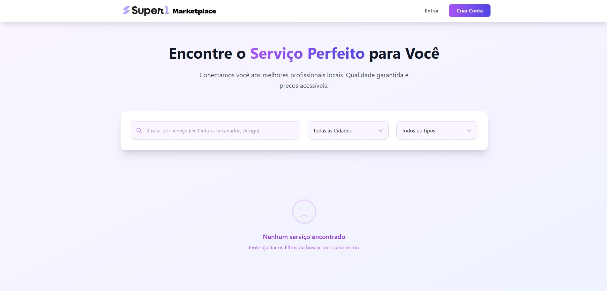

# **Mini Marketplace de Serviços (Versão Completa)**

Este é um sistema de marketplace de serviços para profissionais liberais, construído como parte da Atividade Super1 FullStack. O projeto permite que prestadores de serviços se cadastrem, criem serviços, definam agendas e sejam contratados por clientes.

Esta versão inclui **todas as funcionalidades extra** sugeridas no desafio.

## **Funcionalidades Extra Implementadas**

* ✅ **Avaliações de Clientes:** Sistema de nota (1-5 estrelas) e comentários.  
* ✅ **Geolocalização:** Filtro de serviços por cidade na listagem principal.  
* ✅ **Notificações por E-mail:** Confirmação para o cliente e notificação para o prestador (simuladas no console).  
* ✅ **Busca Inteligente:** Busca com autocomplete/sugestões em tempo real usando **Elasticsearch**.  
* ✅ **Serviços Longos:** Suporte para serviços com duração em DIAS (ex: pintura) além de MINUTOS.  
* ✅ **Descontos:** Prestadores podem configurar descontos para dias específicos da semana.  
* ✅ **Chat em Tempo Real:** Sistema de chat via WebSockets para comunicação entre cliente e prestador.

## **Tecnologias Utilizadas**

* **Backend**: Node.js, ElysiaJS, TypeScript, Prisma, WebSocket  
* **Frontend**: SvelteKit, TypeScript, Tailwind CSS  
* **Banco de Dados**: PostgreSQL  
* **Busca**: Elasticsearch  
* **Ambiente**: Docker, Docker Compose

## **Como Executar o Projeto**

### **1\. Pré-requisitos**

* Docker e Docker Compose instalados.

### **2\. Configuração**

* Clone o repositório.  
* Na raiz do projeto, copie o ficheiro .env.example para um novo ficheiro chamado .env:  
  cp .env.example .env

* (Opcional) Altere os valores no ficheiro .env. Os valores padrão já funcionam para o ambiente de desenvolvimento.

### **3\. Execução**

Execute os seguintes comandos no terminal, na raiz do projeto:

1. **Subir os Contentores:**  
   docker-compose up \--build \-d

2. **Executar a Migração da Base de Dados:**  
   docker-compose exec backend bunx prisma migrate dev

3. **Popular a Base de Dados (Seed):**  
   docker-compose exec backend bunx prisma db seed

## **Acesso e Credenciais**

* **Frontend (Marketplace)**: [http://localhost:5173](https://www.google.com/search?q=http://localhost:5173)  
* **Backend (API)**: [http://localhost:3000](https://www.google.com/search?q=http://localhost:3000)  
* **Swagger (Documentação da API)**: [http://localhost:3000/swagger](https://www.google.com/search?q=http://localhost:3000/swagger)  
* **Prisma Studio (Gerir a BD)**: Execute docker-compose exec backend bunx prisma studio e aceda a [http://localhost:5555](https://www.google.com/search?q=http://localhost:5555)

#### **Credenciais de Exemplo (do Seed):**

* **Prestador 1 (Manicure com desconto na Quarta)**:  
  * **Email**: ana.manicure@example.com  
  * **Senha**: password123  
* **Prestador 2 (Pintor com serviço de longa duração)**:  
  * **Email**: pedro.pintor@example.com  
  * **Senha**: password123  
* **Cliente**:  
  * **Email**: carlos@example.com  
  * **Senha**: password123

## **Print da Interface (Demo)**

